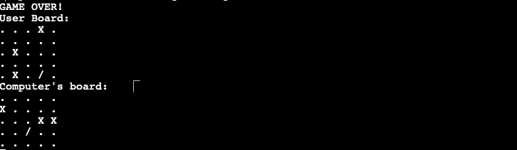

# Battleships

For this project I decided to produce a game of Battleships using Python. This poject will allow the user to play a game of Battleship against a computer.

[LIVE SITE](https://n-ste-battleships-5b8da34f4864.herokuapp.com/)

## How to Play

The rules of the game are quite simple. There will be a 5X5 board for the user and computer. Each board will have 5 ships on it, concealed to the user and computer.

The user and computer will have 5 attempts to guess the location of all 5 of their opponents ships.

If the user and computer guess the correct location of one of their opponents ships they'll receive a message on the terminal and their board will be updated to display this.

At the end of the 5 attempts, the user will be able to compare both boards to determine who won, along with a message advising the game is over.

## Design

In a traditional Battleships game the users would be playing on a 10X10 board, with some ships that span across different columns and rows. However, for simplicity I opted to make the board smaller at 5X5, with each ship only covering one row and column.

### Features

When the game starts the user will be given instructions on the game, these will advise:

* That there will be 5 ships spanned across a 5X5 board.

* The user will be advised they'll have 5 guesses to locate all of the ships on their opponents board.

* 

* The user will then be met with an alert requesting they provide a number between 1 and 4 to choose the row.

* They'll then be advised to select a column number between 1 and 4.

* 

* The user will then be given a message advising if they hit the computer ship or not, and also a message advising if the computer hit theirs. Their board will then be displayed on the terminal.

* 

* This process will repeat 4 more times, at the end both boards will be displayed on the terminal allowing the user to see the overall score by assessing the boards and a "Game Over!" message will appear.

* 

## Testing

### Validation

I tested the game in several ways:

* PEP8 Command Line
  * The issues that arose can be seen in the "Bugs" section below.

* CI Python Linter
  * For this, I followed the link and posted my Pthon code inside. When this came back I was given feedback advising that there were no errors with my code.
  * 

* Playing the Game

#### Bugs

* PEP8 Command Line
  * To validate the Python code using the command line I first had to run "pip install pycodestyle" on the terminal.
  * I then had to run "pycodestyle run.py" to the terminal.
  * This allowed me to see the errors that came with my code:
  * 

#### Solved

* PEP8 Command Line
  * The bug I had came from my lines of code exceeding the recommended amound of characters for Python code, this was mainly for comments.
  * I resolved this by separating my comments into sections and placeing them on the next row that followed.
  * Another issue was that my variable names contributed to the lenth of the lines of code. I resolved this by shortening these variable names.
  * Once amended, I ran "pycodestyle run.py" again and I was met with no feedback.
  * 

#### Remaining

* There were no bugs remaining.

## Deployment

Now I'm going to list the steps necesssary to deploy my project. This has been done with Heroku.

* First I went to [Heroku](https://www.heroku.com/)

* After I'd logged in I was on my Heroku dashboard. The next step was to select the "New" button in the top right hand corner.

* 

* 

* I was then taken to another page requesting I name my app, I called mine "n-ste-battleships". And selected the region I live in. And clicked "create new app."

* 

* You'll then be led to the "Deploy" page. We'll use the deploy page but first, we'll go to the "Settings" page.

* 

* Once on the settings page there are two things you'll need to do.

  * If you've got sensitive information that you don't wish to share but is required for the program to run you'll need to log this dependency on the "Config Vars" section.

  * You'll then need to place the file name in the "KEY" section, and its file contents in the "VALUE" section.

* As I don't have any sensitive information in my project I haven't done this, but I'd added this in for demonstration
purposes.
* 

* I then selected the button below this section to add the build packs to the project by selecting the "Add Buildpack" button.
* 

* I was then met with a page with various buildpacks, I selected "Python" and "Node.JS" in that order and clicked "Add Buildpack" on each.

* 

* When this is done, you'll then be back on the "Settings" page with the buildpacks added, you'll want to make sure the order is "Python," followed by "NodeJS," if these are in the wring order you should reorder them.
* 

* Once this is done, you should go back to the "Settings" page and it will ask youwhat your deployment method is. I've opted to deploy this to Github, so I select this.

* It will then ask for the resository name you want to deploy, I typed in "Battleships_Project
_3" and it found my repository. I then clicked "Connect".

* 

* You'll then have two deployment methods, one is for automatic deployments whenever there are changes to to project. The other is for manual deployments. I chose to deploy manually.

* 

* A log then started to build my project for deployment, once completed there was a button that appeared to take me to the live site.

* 

* I then clicked on the button and this redirected me to the live site, which can be found [HERE.](https://n-ste-battleships-5b8da34f4864.herokuapp.com/)

## Credits

### Python

This project was build and coded using Python.

#### Libraries

For this project I used the Random Python library. This was used to aid me in generating random numbers to be used as the coordiates for the batlleships in my game for both the computer and the users board.

[Gitpod](https://www.gitpod.io/) - Used as the workspace to build the program.

[StackOverflow](https://stackoverflow.com/) - Used to troubleshoot and for help with understanding concepts.

### Code Institute

[Code Institute - Love Sandwiches Walkthrough Project](https://learn.codeinstitute.net/courses/course-v1:CodeInstitute+LS101+1/courseware/293ee9d8ff3542d3b877137ed81b9a5b/58d3e90f9a2043908c62f31e51c15deb/) - Provided me with the building blocks to complete this project.

### Youtube

* [How to Code Battleship in Python - Single Player Game](https://www.youtube.com/watch?v=tF1WRCrd_HQ&t=1314s) - Helped me grasp the concepts needed to make the game function. Credits added as comments in code.
